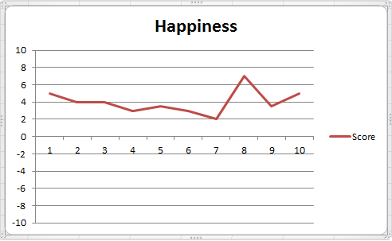

In the last month or so, I&#8217;ve been trying to change tactics for how I approach increasing velocity. I think this all started with a tweet from Luis Gonçalves:

<blockquote class="twitter-tweet" width="550">
  

    Its my impression or <a href="https://twitter.com/hashtag/ScrumMasters?src=hash">#ScrumMasters</a> that are developers care little or nothing with team building activities? Share your opinion 🙂 <a href="https://twitter.com/hashtag/scrum?src=hash">#scrum</a>
  

  
  

    &mdash; Luis Gonçalves (@lgoncalves1979) <a href="https://twitter.com/lgoncalves1979/status/567599147273191424">February 17, 2015</a>
  

</blockquote>

As I&#8217;m a coder by trade, I&#8217;ve been challenging the team to improve our engineering processes as that was what I was more comfortable with. The tweet made me realise that I should spend a lot more effort into the team themselves.

I&#8217;d previously read about the [Happiness Index][1] technique but was reluctant to try it as I was worried that the team would say &#8220;I don&#8217;t remember what I was feeling&#8221;. As what normally happens, this all slipped my mind for a while until I came across something called a [Niko Niko Calendar][2]. I won&#8217;t go into the details of how these two techniques work, as the above two links are great, but the following quote leapt out:

> Feelings are the fastest feedback I know

I don&#8217;t think all of the team were particularly comfortable with analysing their feelings, but I believe it was a very worthwhile exercise to do. At the end of the sprint we ended up with the following chart:

As a team, we then talked through all the events that caused big changes in happiness and plotted the &#8220;average&#8221; happiness on a graph.

This really helped the team focus on the major events and led to some really great discussions. One of our team even said afterwards &#8220;that may have been the best [retrospective] yet&#8221;.

## Summary

Using a Niko Niko Calendar to capture the teams emotional state at the end of each day is brilliant. The information is clear for everyone to see, which allows other team members to offer help if someone is clearly struggling. As a fellow Scrum Master commented:

> A fantastic information radiator

I would highly recommend any Scrum Master to try it out. If you do, I&#8217;d love to hear from you in the comments below or catch me on [twitter][3].

## Personal Retrospective

### What went well

- Changing the focus from engineering to people was fantastic

### What could I have done better?

- Considered the team as well as engineering a lot earlier, but at least I&#8217;ve started!

### What should I not do again?

- I tried to restrict the team to just 🙂 , 😐 and 🙁 in the hope that it would make analysis easier. I think that was a mistake because they didn&#8217;t and it didn&#8217;t affect analysis at all!

[1]: http://www.scruminc.com/happiness-metric-wave-of-future/
[2]: http://agiletrail.com/2011/09/12/how-to-track-the-teams-mood-with-a-niko-niko-calendar/
[3]: https://www.twitter.com/mattdufeu
