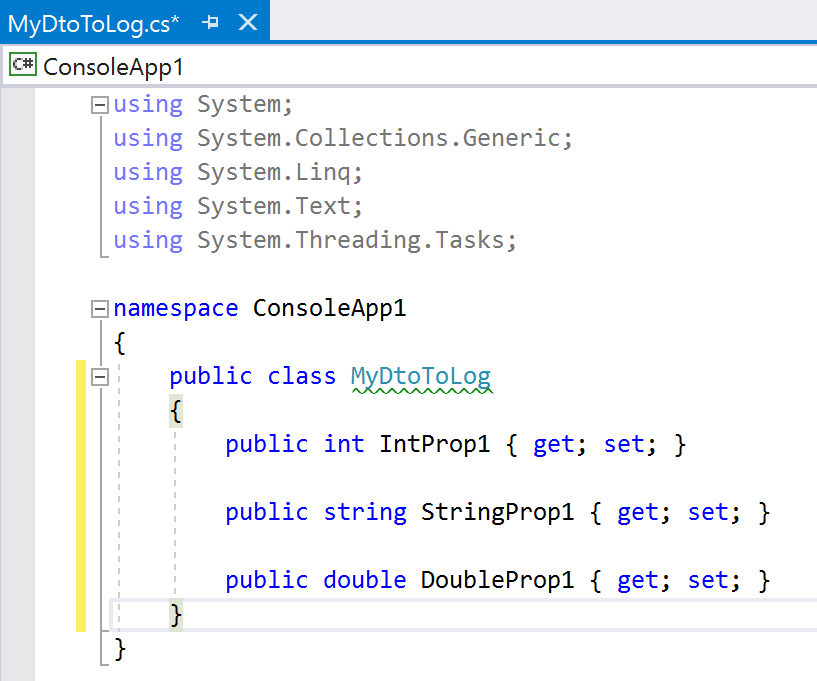
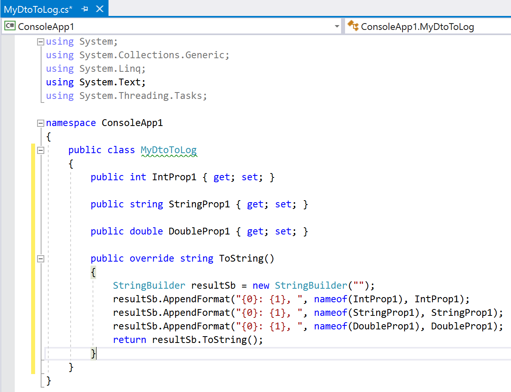

I recently had the opportunity to update the quality of logging in an application. Exceptions were handled well, but it was hard to see the values passed through the layers. I ended up using a _Roslyn CodeFix to add a ToString method_.

## Setup

Once you&#8217;ve created a new &#8220;Analyzer with Code Fix&#8221; project, there&#8217;s two parts to write:

1. The Analyzer &#8211; the code that highlights the problem by adding a green squiggly line;
2. The CodeFix &#8211; the code that runs to &#8220;fix&#8221; the problem highlighted by the analyzer

## The Analyzer

My requirement was straight foreward, &#8220;add a ToString method&#8221; to a class. Turns out the code created in the new project is almost good enough. It highlights any classes declared with lowercase letters. As I want _all_ classes, we can just change the `AnalyzeSymbol` method in Analyzer.cs to:

```csharp
private static void AnalyzeSymbol(SymbolAnalysisContext context)
{
    var namedTypeSymbol = (INamedTypeSymbol)context.Symbol;

    var diagnostic = Diagnostic.Create(Rule,
        namedTypeSymbol.Locations[0],
        namedTypeSymbol.Name);

    context.ReportDiagnostic(diagnostic);
}
```

That&#8217;s it for the analyzer. It passes all Class Declarations to Rosylyn to create a Diagnostic.

If you press F5 now to debug the project, a new instance of Visual Studio will open. This new instance has our analyzer installed. So create a simple console app and you will see all class declarations are decorated with a green squiggly line.

So far, so good. Now to create the codefix.

## The CodeFix

This is a bit more involved. I didn&#8217;t know what I was doing and struggled with the documentation. After some trial and error, this is what I ended up doing:

- Find the class declaration (again, I don&#8217;t think the information from the analyzer gets passed across)
- Loop over all the public properties of that class and construct the ToString method
- Add the new ToString method

### Find the class declaration

The project sample uses `RegisterCodeFixesAsync` in the CodeFixProvider.cs file as the entry point. I changed `RegisterCodeFixesAsync` by first adding:

```csharp
var classDeclaration = root.DescendantNodes().FirstOrDefault(
    node => node is ClassDeclarationSyntax) as ClassDeclarationSyntax;
if (classDeclaration == null) return;
```

And then updating the call to `RegisterCodeFix` to pass this new `classDeclaration` variable. The whole method looks like:

```csharp
public sealed override async Task RegisterCodeFixesAsync(CodeFixContext context)
{
    var root = await context.Document
        .GetSyntaxRootAsync(context.CancellationToken)
        .ConfigureAwait(false);
    var diagnostic = context.Diagnostics.First();

    var classDeclaration = root.DescendantNodes()
        .FirstOrDefault(node => node is ClassDeclarationSyntax)
         as ClassDeclarationSyntax;
    if (classDeclaration == null) return;

    // Register a code action that will invoke the fix.
    context.RegisterCodeFix(
        CodeAction.Create(
            title: title,
            createChangedSolution: c =>
                MakeUppercaseAsync(context.Document, classDeclaration, c),
            equivalenceKey: title),
        diagnostic); 
}
```

That passes all instances of class declarations to a method called `MakeUppercaseAsync`. For this example, it is a terrible name, but it&#8217;s the one created by the project. Feel free to rename it to something more accurate. I&#8217;ve left it to help with cutting and pasting for this post.

Now we&#8217;ve found the class declaration, let&#8217;s build up the ToString method.

### Building the ToString body

To construct the body, we need to find all the properties in the class, loop over them, and create a string that will represent the body.

This gets complicated quickly. We need to write some C#, that will write the C# that makes the ToString method. Confused? I certainly was. I ended up thinking of it as layers on the onion.

The innermost layer of the onion is what&#8217;s in the logs. I wanted the log to contain something like `IntProp1: 5` for a property called `IntProp1` with a value of 5.

The next layer of the onion, is the C# code that you would write to achieve that log format. In this example, it would be something like:

```csharp
Console.WriteLine("{0}: {1}, ", nameof(IntProp1), IntProp1);
```

The outer layer of the onion is the code we put in the CodeFix. It&#8217;s output will be added to the class. It needs to create the C# code, that when ran will output the above `Console.WriteLine`.

Rather than using lots of Console.WriteLine statements, I decided to use a StringBuilder, but the outcome is the same. I ended up with the following to construct the body of the ToString method:

```csharp
SyntaxNode root = await document.GetSyntaxRootAsync(cancellationToken)
    .ConfigureAwait(false);
var props = root.DescendantNodes().Where(x => x is PropertyDeclarationSyntax);

// Construct the contents of the ToString method
StringBuilder sb = new StringBuilder(@"
    StringBuilder resultSb = new StringBuilder("""");
");

foreach (SyntaxNode currentProp in props)
{
    var currentSyntax = currentProp as PropertyDeclarationSyntax;

    sb.Append("resultSb.AppendFormat(\"{0}: {1}, \", nameof(" +
        currentSyntax.Identifier.Value + "), " +
        currentSyntax.Identifier.Value + ");");
    sb.Append(Environment.NewLine);
}
```

As you can see, this loops over all the descendants of the root node (the class declaration) that are Property Declarations. Then appends to a StringBuilder the format we want.

### Putting it all together

My final `MakeUppercaseAsync` method looked like:

```csharp
private async Task<Solution> MakeUppercaseAsync(Document document,
    ClassDeclarationSyntax classDecl,
    CancellationToken cancellationToken)
```

It&#8217;s the code above, with some extra helper methods that I found on stack overflow. For this project, just put them at the end of the class, but a helper library would be a better long term choice.

### Helper Methods

Credit goes to [Nvalchev in this answer on stack overflow][1] for these. They help create method declarations and constructing parameter lists.

```csharp
public MethodDeclarationSyntax GetMethodDeclarationSyntax(string returnTypeName, string methodName, string body)
{
    var syntax = SyntaxFactory.ParseStatement(@"" + body + "return resultSb.ToString();");
    var parameterList = SyntaxFactory.ParameterList(SyntaxFactory.SeparatedList(GetParametersList(new string[0], new string[0])));
    var modifiers = new SyntaxToken[] { SyntaxFactory.Token(SyntaxKind.PublicKeyword), SyntaxFactory.Token(SyntaxKind.OverrideKeyword) };

    return SyntaxFactory.MethodDeclaration(attributeLists: SyntaxFactory.List<AttributeListSyntax>(),
                  modifiers: SyntaxFactory.TokenList(modifiers),
                  returnType: SyntaxFactory.ParseTypeName(returnTypeName),
                  explicitInterfaceSpecifier: null,
                  identifier: SyntaxFactory.Identifier(methodName),
                  typeParameterList: null,
                  parameterList: parameterList,
                  constraintClauses: SyntaxFactory.List<TypeParameterConstraintClauseSyntax>(),
                  body: SyntaxFactory.Block(syntax),
                  semicolonToken: SyntaxFactory.Token(SyntaxKind.SemicolonToken))
          // Annotate that this node should be formatted
          .WithAdditionalAnnotations(Formatter.Annotation);
}

private IEnumerable<ParameterSyntax> GetParametersList(string[] parameterTypes, string[] paramterNames)
{
    for (int i = 0; i < parameterTypes.Length; i++)
    {
        yield return SyntaxFactory.Parameter(attributeLists: SyntaxFactory.List<AttributeListSyntax>(),
                                                 modifiers: SyntaxFactory.TokenList(),
                                                 type: SyntaxFactory.ParseTypeName(parameterTypes[i]),
                                                 identifier: SyntaxFactory.Identifier(paramterNames[i]),
                                                 @default: null);
    }
}
```

If you run this code now, and apply the code fix to a class with some properties, it should add a ToString method.


## Alternatives

Before winding up this post, I think it&#8217;s worth pointing out some other ways of doing it.

My first thought was to use reflection. The idea was to reflect over the objects being logged. I imagine it would&#8217;ve worked, but probably isn&#8217;t great performance wise.

Then I considered just relying on converting the objects to JSON. This has the advantage of &#8220;just working&#8221; for every object. And unless you have a good reason not to go down that route, I think it&#8217;s a great idea.

Unfortunately, both of those suffer the same problem. They are a bit inflexible and they are both all or nothing. I had some properties that shouldn&#8217;t be in the log files. Making sure those weren&#8217;t logged is a lot easier when you have a ToString method.

I&#8217;m sure there&#8217;s a way of using attributes (or something else) to make the other two handle that. But that relies on the dev knowing they are there and it&#8217;s too easy for an object to slip through the gaps. Using a ToString method at least makes it explicit.

Finally, there&#8217;s always ReSharper!

## Conclusions

The solution in this post is far from perfect. There are a number of things that can be improved:

- It doesn&#8217;t handle classes that already have a ToString method very well;
- It doesn&#8217;t add the required &#8220;using&#8221; statements;
- It adds an extra semi-colon at the end
- Property type is ignored, Collections, Lists etc is not handled

Despite those issues, it&#8217;s already saved me a lot of typing. Also, creating a _Roslyn CodeFix to add a ToString method_ was a good learning experience. Getting started was difficult, but the more I use the features of Roslyn, the more convinced I am that I&#8217;ll be doing a lot more in the future.

Let me know if you spot a mistake or an area I can improve on. I&#8217;ve uploaded the code so far to [GitHub][2]. Feel free to make a PR or raise an issue.

[1]: http://stackoverflow.com/a/37743242
[2]: https://github.com/mattdufeu/UsefulRoslynCodeFixes
