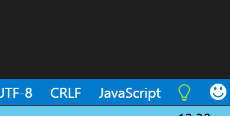

I&#8217;ve been getting back into React.js development and was missing the rich developer experience visual studio gives you with things like intellisense.

I thought I had something working as Ctrl+Space opened intellisense with a sensible suggestion, but this turned out to be the IDE using what I&#8217;d typed earlier to make an educated guess. Clever, but I was hoping for more.


## Dead Ends

Unfortunately I couldn&#8217;t find a simple &#8220;how to&#8221; guide and the stuff I did get from various github issues and stackoverflow didn&#8217;t really help.

After several dead ends and lots of hair pulling I eventually got intellisense working using these steps.

## How To Setup Intellisense in VSCode for React.js

### Step 1 &#8211; Create a jsconfig.json file

With a project folder open, look in the bottom right and you should see a lightbulb:



Click the lightbulb, and you should get a popup at the top of the IDE asking if you want to create a jsconfig.json file


Click &#8220;Create jsconfig.json&#8221; and vscode should do the rest.

### Step 2 &#8211; Install Typings

The Typescript Definition Manager [typings][1] should be installed globally with

```csharp> npm install typings --global

```

This will allow you to install typescript definition files which is what we&#8217;ll do next.

### Step 3 &#8211; Install React Typescript Definitions

In the folder of the project enter the following commands:

```csharp> typings init
&gt; typings install dt~react --global
```

You should end up with a new &#8220;typings&#8221; folder with the following contents:

```bash
│   index.d.ts
│
└───globals
    └───react
            index.d.ts
            typings.json
```

### Step 4 &#8211; Install typescript

You can install typescript globally, but I prefer to put it in each project with the following command

```csharpNpm install typescript@next

```

Which vscode detects automatically, so there&#8217;s nothing else to it.

### Step 5 &#8211; Confirm it Works

Now you should be able to see some intellisense for react.js.


## Conclusion

While attempting to get this working I found some what appears to be old and obsolete advice.

- I haven&#8217;t created a CODE_TSJS or VSCODE_TSJS environment variable
- There are also a couple places mentioning &#8216;tsd&#8217;, but that has been superseded by typings.
- I don&#8217;t have (Salsa) in the bottom right of the IDE. In a different setup I had the version number of typescript, but that doesn&#8217;t appear to be essential.

In all honestly, I don&#8217;t really know what I&#8217;m doing, but it appears to work. Hopefully it will work for you too, but please let me know if it doesn&#8217;t in a comment below or on twitter.

[1]: https://github.com/typings/typings
