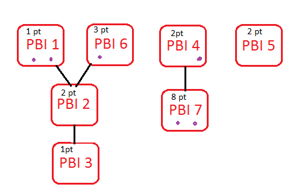

Do your sprint planning meetings contain a lot of disagreements and arguments? Are you spending more time trying to decide how many points a PBI is worth than it would take to develop it? Don&#8217;t worry, you&#8217;re not alone.

To combat this, my current team tried a technique which worked really well. Not only did the meeting take less time than normal, but more of the team were engaged and every team member was happy afterwards.

I&#8217;m sure this has an official name, but I&#8217;m going to call it &#8220;group comparison&#8221; until I find out what that is. Thankfully it&#8217;s really simple.

## Step 0 &#8211; Prepare

Hopefully you&#8217;re performing some sort of [backlog grooming][1] so this is relatively quick. If you&#8217;re not, this planning technique might help, but I strongly encourage you to schedule a regular grooming session. We do 1 hour every 2 week sprint and it seems to be enough. YMMV.

Print out (or create on Post-It notes) the PBIs that you think the team will be able to commit to. I&#8217;d suggest a little more than your velocity after taking into account capacity.

From your planning poke decks, place the cards on the table that match the size of PBI your team can normally deliver in a sprint in a line. For us, this was 1, 2, 3, 5, 8.

## Step 1 &#8211; Introduce the PBIs

This is simply refreshing the minds of all the team members so they know what all the PBIs are.

## Step 2 &#8211; Split the team into groups.

We split into two groups, but I guess you could do more. Basically, each group is invited to come up to the table one group at a time and sort the PBIs under the poker card they think that PBI is.

## Step 3 &#8211; Invite the other teams

Once the first team has finished, invite the next team up. Second and subsequent teams should check the previous grouping. If they disagree with a position of the card, move it to where they think it should be. The team should mark each card with a dot to show that it&#8217;s changed.

Repeat this step for each group and &#8211; excuse the hideous use of paint &#8211; something like this:

## Step 4 &#8211; Discuss any significant changes

Once all the teams have finished, invite everyone back to discuss any cards that have moved twice, i.e. have two dots. It doesn&#8217;t matter if they&#8217;ve moved from 3 to 5 and back to 3, just discuss them so the group can have a consensus.

## Step 5 &#8211; Write the story points on each card

Once that&#8217;s finished, there should be some sort of agreement to the size of the PBIs, so write the story points on the cards. This step is really important as we&#8217;re about to move them all around!

## Step 6 &#8211; Order by dependencies

Ask the whole team (or a subset if you&#8217;re a really large team) to order these by dependencies . We used a column for each chain of dependencies and staggered them if there was some overlap, i.e. shared parents.

As you can see in the above image:

- PBIs 1, 4, 6 and 7 were marked, and the team discussed 1 and 7 further;
- PBIs 1, 6, 4 and 5 have no dependencies so can be started at any time;
- PBI 7 has a dependency on PBI 4;
- PBI 3 has a dependency on PBI 2;
- PBI 2 has a dependency on both PBI 1 and PBI 6.

## Step 7 &#8211; Mark Dependencies

By now, the PBIs should be sorted not only by size, but it should also be clear which are dependent on another PBI and which are standalone. Simply write this information on each card ready to transfer to your tool of choice.

## Final Step &#8211; Task Breakdown

Perform you&#8217;re task breakdown as normal and you&#8217;re done.

It&#8217;s important to note, that the team can change their mind about something half way through. Just because a PBI started step 5 as 8 story points and dependant on another one, doesn&#8217;t mean it needs to end up in that state.

# Conclusion

Once you&#8217;ve completed this, you should have a sized and sorted set of PBIs ready to be committed to and placed in the sprint backlog. If it&#8217;s anything like us, you&#8217;ll see the following benefits:

- You score PBIs much quicker
- The PBIs are scored relative to each other
- It&#8217;s easy to work out dependencies
- _MUCH_ less arguing
- _MUCH_ more team engagement

The only downside I can see, is that it&#8217;s possible for the business priorities to get lost in the re-shuffle. As this is limited to just the sprint and you&#8217;re going to deliver them all, it&#8217;s not a problem.

[1]: http://www.romanpichler.com/blog/the-product-backlog-grooming-steps/
