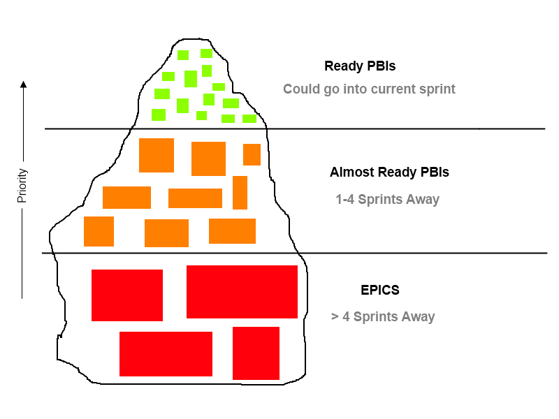

Backlog refinement isn&#8217;t a prescribed meeting, instead the [Scrum Guide][1] states:

> The Scrum Team decides how and when refinement is done.

Perhaps that&#8217;s why it&#8217;s not taken as seriously as the other scrum events, or worse, forgotten or ignored. I&#8217;ve lost count of the number of project managers (or &#8220;non-agile&#8221; people) ask &#8220;why are you spending time talking about the PBIs again?&#8221;. Maybe it&#8217;s external pressure making teams drop refinement, but either way, it&#8217;s a _big_ mistake.

The team I&#8217;m currently working with have seen some real benefits from backlog refinement, so I thought I&#8217;d get my thoughts down for the next time someone asks &#8220;what are you doing?&#8221;.

## What is Backlog Refinement?

I won&#8217;t go into depth as to what backlog grooming is as there are [numerous][2] [guides][3] out there. Instead I&#8217;ll use the classic iceberg metaphor, i.e. the backlog has epics and the bottom, almost ready Product Backlog Items (PBIs or user stories) in the middle and some ready PBIs at the top:

Basically, the meeting is for the team to help the product owner move user stories up the Product Backlog. This raises awareness of the upcoming story and helps the Product Owner break the larger items down into user stories that the team feel could pull them into the next sprint.

As a rule (which isn&#8217;t always possible for whatever reason), I like my teams to have a &#8220;buffer&#8221; of at least 2 sprints worth of Ready PBIs. Any less makes the next sprint planning problematic and any more I find priorities change and/or the team forget the details.

## How long is Backlog Refinement?

Again, there isn&#8217;t a hard and fast rule for how long this event should be. The Scrum Guide says (emphasis mine):

> Refinement usually consumes no more than 10% of the capacity of the Development Team. However, Product Backlog items can be updated _at any time_ by the Product Owner or at the Product Owner’s discretion.

As with everything scrum, it&#8217;s about finding a number that is just enough for your team to get the most amount of benefit and no more.

## When should we do Backlog Refinement?

The current team I&#8217;m working with have tried lots of things. We&#8217;re currently have 2 regular events:

1. An hour every week where the whole team sits down together and the Product Owner guides us through the backlog.
2. Each team member is encouraged to spend at least 30 minutes each week going through the backlog on their own. (This started off as a meeting set in their calendars but we couldn&#8217;t find a time that suited everyone, so the team are trusted to do this whenever it&#8217;s convenient).

As long as it gets done, and the team are seeing the benefits, I prefer to let the team decide.

## The importance of backlog refinement

There are many more reasons to perform backlog refinement than I&#8217;m going to list, but for me, the main benefits are:

- Increased awareness of upcoming work. This leads to greater team buy-in and morale benefits
- Smoother planning meetings (important if you have stakeholders attending)
- Better understanding. The team can plan better, leading to less conflicts and an increased velocity
- Fewer mid-sprint surprises like &#8220;we didn&#8217;t realise it was this complicated&#8221;.

I&#8217;ve read recently how [Developers shouldn&#8217;t measure twice, cut once][4] and I think for the really excellent teams who know their code base inside out this may hold true. But for the rest of us, a little preparation can go a long _long_ way.

[1]: http://www.scrumguides.org/
[2]: http://guide.agilealliance.org/guide/backlog-grooming.html
[3]: http://blogs.collab.net/agile/the-backlog-refinement-meeting-or-backlog-grooming#.VUtqApOAn-s
[4]: http://www.haneycodes.net/developers-shouldnt-measure-twice-cut-once/
