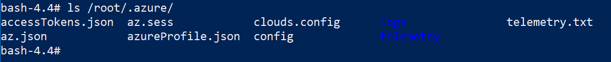

I've been using Docker for more development tasks recently. Pulling a new pre-configured image and getting on with what I'm trying to do saves a lot of time. I've lost count of the number of hours I've "lost" chasing version numbers. Downloading files, installing them and then figuring out why it doesn't work isn't fun. When I read you can run the Azure CLI in a Docker container, I decided to use it.

However, authenticating with `az login` every time got old quick. Here's how I managed to persist the azure cli docker container credentials between sessions.

## What az login stores

After logging in with `az login`, several files are created in `/root/.azure`:



These files aren't persisted when you stop the container. But they will be if we use [Docker Volumes](https://docs.docker.com/storage/volumes/).

## Docker volumes

The documentation for [Docker Volumes](https://docs.docker.com/storage/volumes/) is good, if a little long. It seems the advice is to use --mount over -v, so I ended up with the following:

```powershell

PS C:\> docker run --rm -it --mount source=azurecli, \
target=/root/.azure microsoft/azure-cli

```

> New users should try --mount syntax which is simpler than --volume syntax.

## Possible Negative

I'm not sure how up to date this information is. But there appears to be a preview feature of "Using credentials from Azure CLI Automatically". I found it <https://github.com/Azure/azure-libraries-for-java/blob/master/AUTH.md>, which allows you to initialize the Azure client in code with:

```csharp
Azure azure = Azure.authenticate(AzureCliCredentials.create())
  .withDefaultSubscription();
```

I currently don't see how that works with the Azure-Cli in the container, but that's hopefully my current level of knowledge, rather than a flaw.

I don't think it's an issue for me, but I guess it could affect someone so thought I would point it out just in case.

## Conclusion

That's it, now I don't have to `az login` every time I start up the container.
