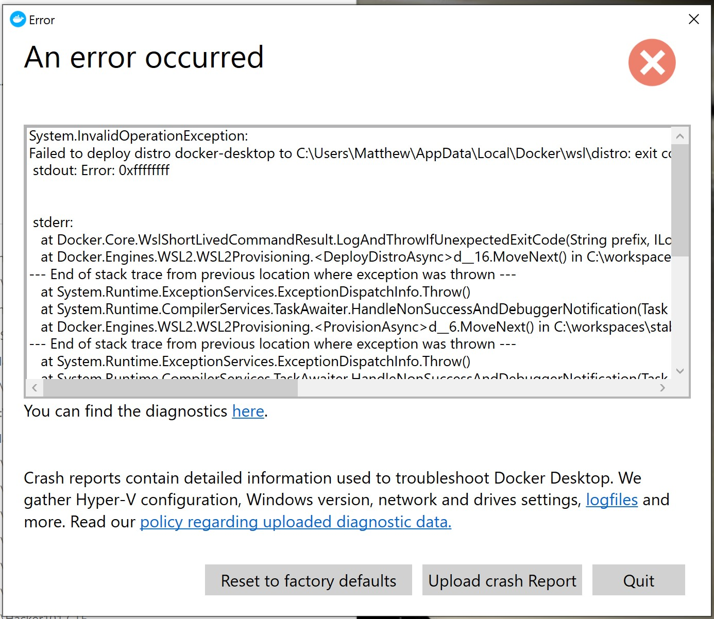

The problem doesn't happen everytime, but when it does, launching a WSL bash prompt shows a 0xffffffff error:


Docker for Windows create a crash report dialog.



There's [an open issue in the github WSL repo](https://github.com/microsoft/WSL/issues/4364) so hopefully it'll be solved soon. In the mean time, both of them seem to be related to port 53 being used by another program. PowerShell to the rescue:

```powershell
Get-Process -Id (Get-NetUDPEndpoint -LocalPort 53).OwningProcess

C:\> Get-Process -Id (Get-NetUDPEndpoint -LocalPort 53).OwningProces

Handles  NPM(K)    PM(K)      WS(K)     CPU(s)     Id     SI ProcessName
-------  ------    -----      -----     ------     --     -- -----------
      0       0       60          8                 7463   0 docker
      0       0       60          8                 8463   0 svchost
```

In my case I got two hits, so take a note of the Id and terminate both processes with:

```powershell
Stop-Process -Id <ID>
```

Once I had to add an `--force` onto the end of that command to make sure.

After that, I was now to restart Docker and WSL without any problems until the next reboot.
