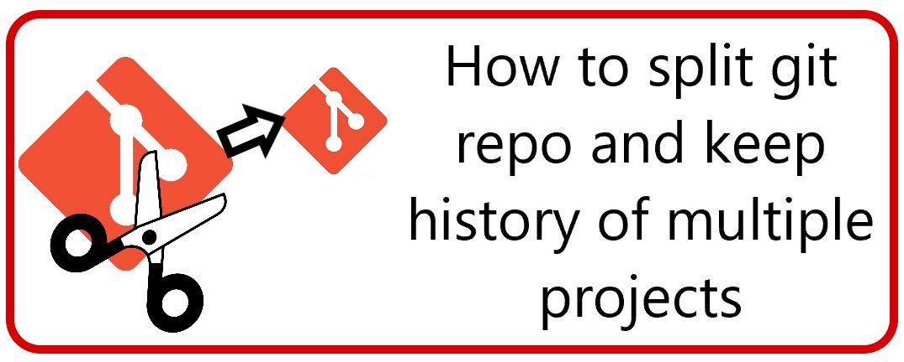

Like them or loathe them, microservices are still all the rage and I'm seeing more and more companies go down this route. A common start the journey into microservices is breaking up an existing monolith.

I'll show how you can split off several pieces of a large repository into a single, smaller repo while maintaining the git history. I'll be using AutoMapper as an example, but the same steps should apply if you need to split several project from a larger solution and keep the history.

At the end of this process you should have:

- A new repository containing all the files, projects, test etc that you want to spliut
- Full git history of the split off code
- The dev, master and any other branches you want to keep
- All the tags

## Background Info

The tool we're going to use, [git filter-repo](https://github.com/newren/git-filter-repo) works by playing back every single commit into a new repo keeping only the bits you tell it to. We're going to do this "filtering" on a "path" basis, i.e. if the commit contained file that was changed in a path particular, keep it, otherwise ignore it.

To demonstrate this, without a very contrived example, let's imagine we want to split the [AutoMapper](https://github.com/AutoMapper/AutoMapper) repo. At the time of writing, the top level directory

## Step 0 - Install git-filter-repo

Follow the installation instructions from github. I had to:

1. Install Python via chocolatey
1. Clone the repo
1. Update the first line of git-filter-repo so it's "python" instead of "python3"
1. Run `cp git-filter-repo $(git --exec-path)`

## Step 1 - Identify the folders required

We need to identify the minimum number of files (projects, config files etc) to allow the piece to be split off to run.

### src

We did this by:

- Creating a new folder with an empty solution
- Copying in the root project, e.g. AutoMapper-Keep
- Then copying in the "project" dependecies:
  

Repeating this final step until the new solution builds and runs as expected.

### tests

Once the src projects are copied across, copy all the corresponding test projects.

### File of files to keep

Once you're happy the new solution works, you need to create a "files-to-keep" file containing a file/folder one per line. For Identity Server we ended up with

```
.editorconfig
.gitattributes
.gitignore

```

You could try `find -maxdepth 3 -type d | grep -v ".git\|.vs\|bin\|obj"` in git bash to get a list that you can prune down.

## Step 2 - Creating the new repo

NB. You will have to do all the following commands in "git bash" which should've been installed with git.

1. Clone the repo

The tool must be run on a fresh clone. You'll likely be repeating these steps many times, so I also took a zip of the freshly cloned repo to speed up the process (especially if you have poor download speeds).

2. Analyse the repo

Run `git filter-repo --analyze`.

**Pay attention to any warnings in the output**. For example, on AZ repo, we get:

```
$ git filter-repo --analyze
Processed 59324 blob sizes
Processed 1908 commitswarning: inexact rename detection was skipped due to too many files.
warning: you may want to set your diff.renameLimit variable to at least 476 and retry the command.
Processed 2089 commits
Writing reports to .git\filter-repo\analysis...done.
```

Which can be solved by running `git config diff.renameLimit 476`. Keep repeating the analyze command and resolving them until there are no more warnings.

3. Perform the filter with `git filter-repo --paths-from-file <path_to_file_from_previous_step>`

## Step 3 - Creating and Testing new solution file

This can be automated by:

- echo "dotnet new sln" > add_to_solution.sh
- find . -name "\*.csproj" -exec echo "dotnet sln add {}" \\; >> add_to_solution.sh
- ./add_to_solution.sh

The solution file created will take the name of the folder, so rename XXX.sln to YYY.sln.

Open the resulting solution file (will be the same name as the folder you're in) in Visual Studio

In Visual Studio, confirm:

1. It builds
2. It runs as expected
3. All the tests pass

This step took a long time because we had several issues with incorrectly spelled filenames, test projects being dependent on projects that aren't required to run the project etc.

## Step 4 - Clearing out unwanted git refs

As detailed in the discussion of #36302 the tool creates _all_ the current branches, tags, refs etc including "replace" refs. We don't want _all_ of them. Thankfully it's possible to automate the removal by running:

- `git show-ref | grep -v '\/tags\|\/dev\|\/release\|\/master' | sed -e s/[0-9a-f]*/delete/ > show-ref-delete-commands.txt` - This will delete all branches and replace refs that are not tags, dev, release/\* or master. You might want to compare this file with the output of `git show-ref` to be absolutely sure
- `cat show-ref-delete-commands.txt | git update-ref --stdin`

## Step 5 - Push to a new origin

Create a new repo in Azure DevOps. It should contain instructions on how to push an existing repo, something like:

```
git remote add origin  "new_origin"
git push -u origin --all
```

That should push the tags too, but if not, `git push --tags` will.

## Step 6 - Test

Take a fresh clone of this repo and retest. Hopefully at this point you can "fall forward"

## Step 7 - Setup branch policies

Finally, setup branch policies.

## Step 8 - Create new Build and Release pipelines
