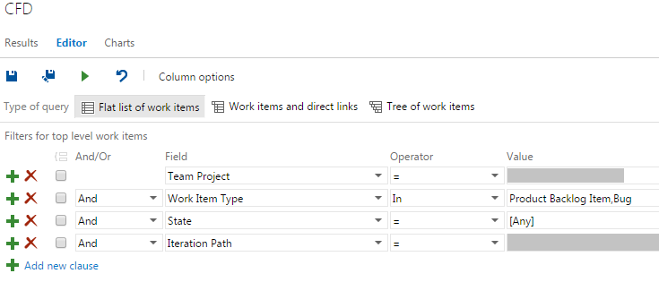

One of the teams I&#8217;ve worked with frequently ended a sprint with 2 or more user stories &#8220;almost&#8221; ready. To them &#8220;almost&#8221; meant less than 2 hours, but in reality, due to sprint planning, task breakdowns etc, we more often than not finished those user stories on day 2 of the next sprint.

There were a number of reasons for this, but to aid in our investigation into why, I used a [Cumulative Flow Diagram (CFD)][1] each sprint.

There are any number of ways of creating CFDs and some people are lucky enough to be using a tool that does it for you. Unfortunately TFS, the tool I was using, wasn&#8217;t one of them. After some searching I eventually found a great post called [Cumulative Flow Diagram – How to create one in Excel 2010][2]

It was almost exactly what I wanted, but because it needed manual data entry, I was manually digging through TFS searching for the right info. That&#8217;s not _too_ bad **if** you remember to do it every day, but I&#8217;d often not be able to due to meetings or some other commitment, let alone illness or annual leave.

What I wanted, was a way to extract the information on a daily basis without me having to open a web browser.

### Less Manual Approach

### Part 1 &#8211; What data do I need

This was fairly simple as I realised I need to know:

- The User Story ID
- Who the User Story is assigned to? That way I know if it&#8217;s in &#8220;Development&#8221; (not the testers or product owner), &#8220;Testing&#8221; (one of the testers) or &#8220;Ready&#8221; (the product owner)
- The State, which is one of &#8220;Committed&#8221;, &#8220;In Progress&#8221;, &#8220;Done&#8221;

That way, I can calculate the current status of a User Story by the logic in the following table:

| State     |  Assigned To  |      Status |
| --------- | :-----------: | ----------: |
| Committed |     Empty     |       To Do |
| Committed |   A Tester    |     Testing |
| Committed | Product Owner |       Ready |
| Committed |  Anyone Else  | In Progress |
| Done      |      n/a      |        Done |

### Part 2 &#8211; Write TFS Query

Getting the data out of TFS is relative simple. In the web interface, go to Work->Queries, create a new &#8220;My Queries&#8221; called CFD and fill it out as below, where &#8220;Iteration Path&#8221; is your current iteration:



It doesn&#8217;t matter how you configure the column options for this query as we&#8217;ll be extracting things via C# next.

### Part 2 &#8211; Command Line Tool

Running the above query from C# is also simple. The below code clearly has a lot to be desired, but it was a quick 5 second proof of concept and as it&#8217;s been &#8220;good enough&#8221; I&#8217;ve never tweaked it.

```csharp
using Microsoft.TeamFoundation.Client;
using Microsoft.TeamFoundation.WorkItemTracking.Client;

using System;
using System.Configuration;

namespace CFDConsoleApp
{
    class Program
    {
        static void Main(string[] args)
        {
	    var tfsServer = ConfigurationManager.AppSettings["TFS_SERVER"];
            var projectName = ConfigurationManager.AppSettings["PROJECT_NAME"];
            var queryFolder = ConfigurationManager.AppSettings["QUERY_FOLDER"];
            var queryName = ConfigurationManager.AppSettings["QUERY_NAME"];

            // Connect to the work item store
            var tpc = new TfsTeamProjectCollection(new Uri(tfsServer));
            var workItemStore = (WorkItemStore)tpc.GetService(typeof(WorkItemStore));

            // Run a saved query.
            var queryRoot = workItemStore.Projects[projectName].QueryHierarchy;
            var folder = (QueryFolder)queryRoot[queryFolder];
            var query = (QueryDefinition)folder[queryName];

            var queryResults = workItemStore.Query(query.QueryText);

            for (int i = 0; i < queryResults.Count; i++)
            {
                Console.WriteLine(
                    "{0},{1},{2}",
                    queryResults[i].Id,
                    queryResults[i].Fields["Assigned To"].Value,
                    queryResults[i].State);
            }

            Console.ReadLine();
        }
    }
}
```

As you can see, I&#8217;ve placed some stuff in the App.config under App.Settings, but otherwise it&#8217;s very simple.

### Part 3 &#8211; Scheduled Tasks

So I don&#8217;t have to remember to run this every day, I set up a scheduled tasks to run every morning at 8am, running the following command to output to a file called the current days date and time.

```csharp
cfd_console.exe &gt; %date:~10,4%_%date:~4,2%_%date:~7,2%__%time:~0,2%_%time:~3,2%_%time:~6,2%.txt

```

This way, for whatever time period you want, you just have to use those files. No outlook reminders or alarms!

### Part 4 &#8211; Cumulative Flow Diagram from TFS Data

When you have a period of time you want to produce a CFD chart for, simply take the relevant .txt files and import the data into the excel template from the above post.

I&#8217;m sure this could be automated also, but as it only takes a few minutes every iteration I haven&#8217;t bothered.

### Summary

The above way is still fairly manual, but it&#8217;s quicker than looking at PBIs and Tasks in TFS regularly. There&#8217;s also a lot to be desired with the coding, but it serves its purpose!

I could of course make this into an Excel app and possibly automate the whole thing, but for now, it&#8217;s more than good enough for my needs. One day maybe that will change, but in the meantime, feel free to take the above and adapt it to your needs.

Finally, if you&#8217;re not already creating a CFD for each sprint, I highly recommend you do. It&#8217;s a great easy way to explain to both the team and any stakeholders the work in progress and how it affects throughput.

[1]: http://brodzinski.com/2013/07/cumulative-flow-diagram.html
[2]: https://hakanforss.wordpress.com/2011/06/17/cumulative-flow-diagram-how-to-create-one-in-excel-2010/
