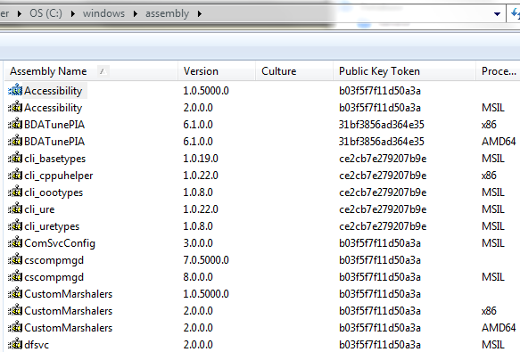

This is going to be a quick post as I&#8217;m hoping that posting about it will help me remember. At worse, I should be able to remember I posted about it and find this page.

There are numerous times when you need to need to reference an assembly using the fully qualified name, e.g.:

  MyNamespace.MyAssembly, version=1.0.3300.0, Culture=neutral, PublicKeyToken=b77a5c561934e089

  Jeremiah Clark has a <a title="Visual Studio Tip" href="http://blogs.msdn.com/b/miah/archive/2008/02/19/visual-studio-tip-get-public-key-token-for-a-stong-named-assembly.aspx" target="_blank">Visual Studio Tip</a> on how to find this for your own assembly but today I needed to find the reference for an assembly deployed in the GAC. A colleague pointed out you can simply browse to c:\windows\assembly using Explorer:

