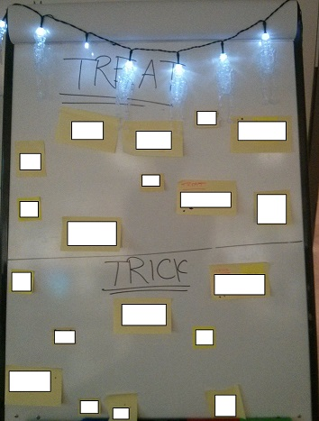
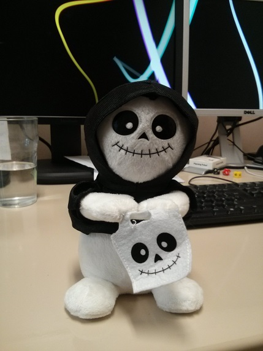

The end of the sprint was approaching and I was researching which technique to try next, when I saw this tweet from [@aaronjmckenna][1] which I had to try:

<blockquote class="twitter-tweet" width="550">
  

    Running a Halloween Themed Retrospective! <a href="http://t.co/WGXxCb0HDe">http://t.co/WGXxCb0HDe</a> <a href="https://twitter.com/hashtag/Agile?src=hash">#Agile</a> <a href="https://twitter.com/hashtag/Retrospective?src=hash">#Retrospective</a> <a href="https://twitter.com/hashtag/ContinuousImprovement?src=hash">#ContinuousImprovement</a>
  

  
  

    &mdash; Aaron McKenna (@aaronjmckenna) <a href="https://twitter.com/aaronjmckenna/status/528130383389261825">October 31, 2014</a>
  

</blockquote>

Thankfully the team are used to the 5 stages technique so after getting some speakers from IT, queuing up a few spooky songs and introducing the theme, we plowed head first into it.

## Stage 1 &#8211; Setting the Scene &#8211; Halloween Treats

_Each team member should think of a Halloween treat to describe how the last sprint went_

As with all first stage techniques, this was great at getting every single member of the team to talk at least once and generally wake people up. We had some nice friendly banter at weird definitions of treats, so the team were set for the next stages.

## Stage 2 &#8211; Gathering Data &#8211; Ghost Stories

_Each member of the team had to come up with a scary story (which could have a happy ending) describing a key event in the last sprint_

This was probably the least successful part of the retrospective as only a small number of team made an actual story. That&#8217;s a problem with either my explanation or the team, not the technique, and we still ended up with a decent set of views.

## Stage 3 &#8211; Generate Insights &#8211; Trick or Treat

_Each member of the team had to come up with 1 treat (something that will help improve the team) and 1 trick (something that is or could hold us back)_

This worked really well as it limited everyone to just one idea. As you can see below, I also decorated the board:

## Stage 4 &#8211; Decide what to do &#8211; Pick a Door

_The team had to decide which doors to visit to talk about, aka dot voting_

## Stage 5 &#8211; Closing the Retrospective &#8211; Spook of the Sprint

_Each member of the team had to thank one other member for something they did in the last sprint._

I must admit, we don&#8217;t normally do much for this part of the retrospective and we certainly don&#8217;t do anything as gushy as thanking each other, so I was a little skeptical!

I could tell by the audible groans from the team that they thought the same thing when I introduced the idea, but I&#8217;m pleased to say it was quite a positive thing. What&#8217;s more, we now have a wonderful mascot for the next sprint.

# Summary

All in all, this was one of our better sprint retrospectives and I really like using a theme. Aaron&#8217;s idea of timing each thinking section with a song worked fantastically, so I&#8217;ll be looking to do that again.

I&#8217;ll also definitely be [keeping an eye on his blog][2] for any future themes to try.

## Personal Retrospective

### What went well?

- The limit of 1 good thing and 1 bad thing helped focus the team. I&#8217;m not sure I would use this for every retrospective as it&#8217;s nice to let the team vent, but it&#8217;s a good way of getting to the most important matters.

### What could I have done better?

- Given more time (and courage) it would have been nice to decorate the room a bit more;
- I&#8217;m not convinced I summarized the stories from the second stage clearly on the board, or even guided the team to use these as a basis for the next step. I think I&#8217;ll try and get the team to come up with a summary statement next time, rather than something only I understand.

### What should I not do again

- Talk about writing a blog post over a week before having the time to do it!

[1]: https://twitter.com/aaronjmckenna
[2]: http://www.aaronisagile.com/
