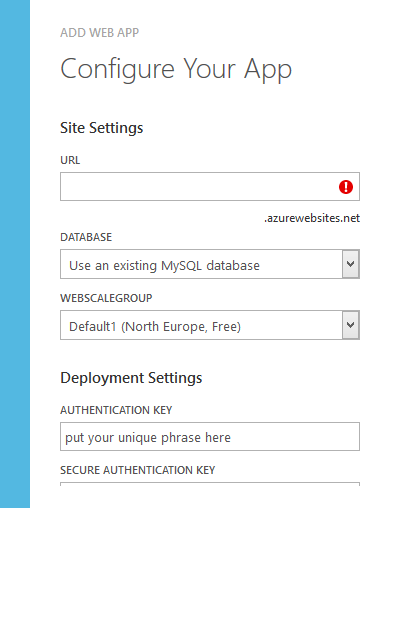
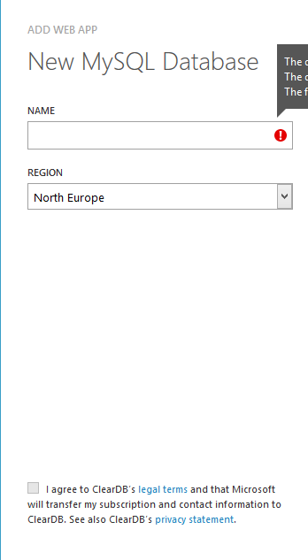

I suffered some minor data loss today which I managed to restore from backup, but not before a few minutes of &#8220;why can&#8217;t I restore&#8221;. It reminded me of the classic quote:

> &#8220;Backups always succeed. It&#8217;s restores that fail.&#8221;

I then realised that although this site is backed up via the excellent [UpdraftPlus Backup / Restore / Clone plugin for WordPress](http://updraftplus.com/) I&#8217;d never tested the backup.

So, I did some digging and it seems the [general advice](http://codex.wordpress.org/Upgrading_WordPress_Extended#Step_3:_Verify_the_backups) is to see if you can open the zip file the backup process produces. Now call me a skeptic, but that makes me a little uncomfortable. Restoring on top of this site (_shudder_) or [restoring to a sub-domain](http://www.warriorforum.com/main-internet-marketing-discussion-forum/880894-how-do-you-guys-verify-your-wordpress-backups-working.html#post8794155) was also unappealing and then I remembered Azure.

I&#8217;m lucky enough to have a MSDN subscription which gets me some free Azure time, but there always seems to be free trials out there. Once I was logged into the management portal the process was very simple. Click New -> Compute -> Web Site -> From Gallery -> WordPress and fill out the following two dialogs:

I didn&#8217;t bother filling out the &#8220;Deployment Settings&#8221; section as I would be deleting the site as soon as I was done.

Once Azure has done it&#8217;s thing, go to the websites dashboard and find the URL which will be something like &#8220;restoredsite.azurewebsites.net&#8221;. Go there and WordPress will lead you through the installation steps of setting up an admin account. Once that&#8217;s finished, all that remains is to install your backup plugin of choice, upload your backup file and hit restore.

If all is well, after a little while (depending on how big your site is) you should see your blog, but hosted in azure at &#8220;restoresdite.azurewebsites.net&#8221;. All your links will redirect to your original domain, so be careful which site you&#8217;re on, but you can verify that everything has come back correctly.
