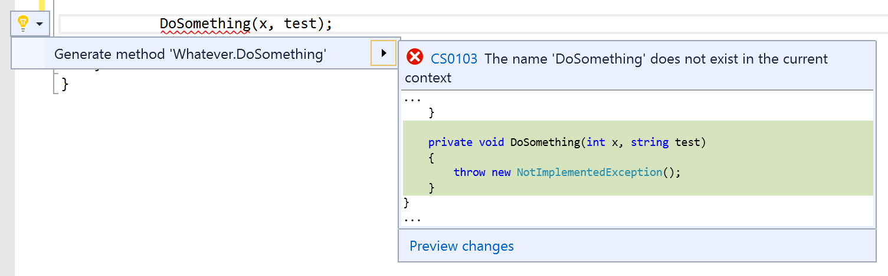
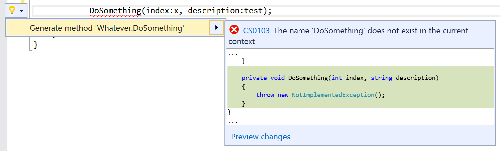

Really quick tip that I found recently while refactoring some old code.

If your using &#8220;Generate Method&#8221; (Ctrl + .) in Visual Studio, the method you&#8217;re generating uses the same names as the local variables for parameter names:

I don&#8217;t know about you, but I then have to spent more than a zero time tidying it up to be more meaningful. Thankfully named parameters can take care of that for you:

Seems to work for constructors and other refactors too.

Maybe it&#8217;s common knowledge, but it pleased me, so by putting it here I can remind myself in a couple <del datetime="2015-10-04T13:12:08+00:00">years </del>weeks time when I forget.
